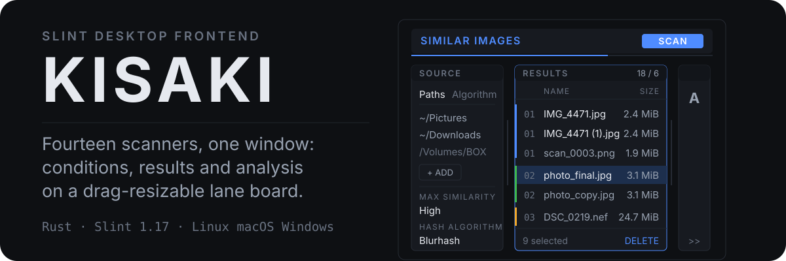
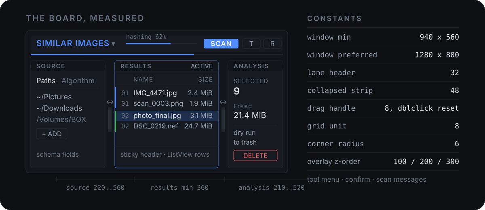
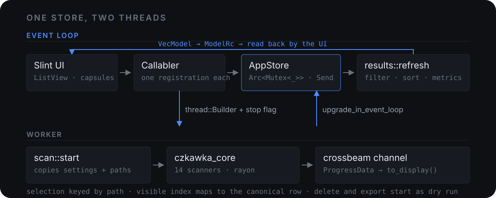

<p>
  
</p>

<p align="right"><a href="./README.md">English</a> · 简体中文</p>

> 本文为 [README.md](./README.md) 的中文译本，内容以英文原文为准。

**Kisaki 是 [Czkawka](https://github.com/qarmin/czkawka) 清理引擎的一个新桌面前端，用 Slint 写成。**
本仓库是 Czkawka 的 fork：扫描引擎和其中所有其他前端都属于上游，`kisaki/` 才是这个 fork 加进来的东西。

## 这个 fork 加了什么

一个 crate，以及它之外的 16 行。

| | |
|:--|:--|
| `kisaki/` | 16 个文件 3 975 行 Rust，12 个文件 2 247 行 Slint |
| `kisaki/` 之外 | `+16 -4` 分布在 `Cargo.toml`（workspace 成员）、`justfile`、`misc/run_checks.sh`、`misc/change_version.py`，另有新增的 `Cargo.lock` 条目、`.github/workflows/kisaki.yml`、`data/com.github.hibernerglow.kisaki.desktop` 与同名 `.metainfo.xml` |
| 边界 | 绝不为了让 UI 功能省事而改 `czkawka_core`，也绝不动手重排上游代码风格，因为两者都会毁掉以后的 rebase |

Kisaki 不复用 Krokiet 的 UI。它的 Rust 侧照搬 Krokiet 的*机制*（每次扫描一个工作线程、`crossbeam`
进度通道、`Arc<AtomicBool>` 停止标志、所有对 Slint 的修改都通过 `upgrade_in_event_loop` 推回事件循环），
但布局、导航、结果表、进度显示、文件操作界面和主题都是 Kisaki 自己的。

## 面板与尺寸

<p>
  
</p>

两条决定是承重的：

- **瑞士 / 国际主义排版风格。** 平面色块、唯一的 8 px 间距单位、1 px 细线是唯一体饰，层级靠字号与字重
  而不是颜色，颜色只表示状态：`primary` 表示选中与运行中，`danger` 表示破坏性操作，`warn` 与 `ok`
  表示结果。没有阴影、没有渐变、没有图标美术：在真正的美术资源出现之前，标记一律用排版字符。深浅两套
  配色都由同一个 `Theme.dark` 派生。
- **三条泳道。** 顶部标题栏承载扫描器选择、扫描/停止、实时进度条、主题切换与布局重置。下方依次是
  Source（路径 + 按 schema 生成的算法选项）、Results（结果表）与 Analysis（统计、dry run 与回收站
  开关、删除、导出）。泳道可拖拽调宽，双击复位到 300 px，也可折叠成 48 px 的窄条，窄条上只显示一个字母。
- **有尺寸。** 窗口默认 1280 x 800、最小 940 x 560；泳道标题条 32 px；圆角 6 px；Source 宽度限制在
  220..560，Analysis 在 210..520，Results 至少 360；三层浮动的 z 序依次是 100、200、300。

## 扫描器

共 14 个，全部由引擎提供：

重复文件 · 空文件夹 · 大文件 · 空文件 · 临时文件 · 相似图片 · 相似视频 · 相同音乐 · 无效符号链接 ·
损坏文件 · 错误扩展名 · 不良文件名 · EXIF 清除 · 视频优化

## 一次扫描是怎么跑的

<p>
  
</p>

- `Arc<Mutex<_>>` 包裹的 `AppStore` 是唯一真源，Slint 的 model 只是它的投影。
- 表格交回的是**可见** model 中的位置，由 `store.visible` 映射到规范行，永远不会拿 UI 下标直接去索引
  `store.rows`。
- 选中状态以**路径**为键，因此重排序、重过滤之后依然有效。
- 绝不在事件循环之外触碰 `ModelRc`。
- 每个 `Callabler` 回调只注册一次；注册为零或重复时 `misc/find_unused_callbacks.py` 会直接失败。

## 构建

```sh
cargo build -p kisaki     # debug
just run kisaki           # debug 运行
just runr kisaki          # fast_release 运行
```

默认 feature 是 `winit_femtovg` 与 `winit_software`。需要原生库的 feature 与 Krokiet 一样默认关闭：
`heif`、`libraw`、`libavif`、`xdg_portal_trash`。渲染后端可用 `femtovg_wgpu`、`skia_opengl` 或
`skia_vulkan` 替换。

需要 Rust 1.94.1 或更新版本（edition 2024）。

这个 crate 的任何改动收尾前，请跑按包的门禁，而不是整个 workspace：

```sh
cargo clippy -p kisaki --all-targets --all-features -- -D warnings
python3 misc/find_unused_callbacks.py kisaki
python3 misc/find_unused_fluent_translations.py kisaki
```

## 安全

删除与导出默认是 **dry run**：只给出一份逐项计划，不碰任何文件。必须先关掉 dry run 才会真正写入，而确认
对话框会写明当前处于哪种模式。删除走 `czkawka_core` 的文件操作，因此「移到回收站」的行为与其他所有
Czkawka 前端一致。

## 还没有的部分

结果缩略图与图片预览、四模式图片对比对话框、智能选择助手、多维度过滤面板（目前只接了文本过滤）、
Simiu 集合模式，以及视频优化与 EXIF 的执行对话框。这些属于计划中逐页补齐的功能，不是扫描引擎的缺口。

## 同族的其他前端

| Crate | 是什么 | 许可 | 文档 |
|:--|:--|:--|:--|
| `czkawka_core` | 扫描引擎，所有前端都依赖它 | MIT | [README](czkawka_core/README.md) |
| `czkawka_cli` | 命令行前端 | MIT | [README](czkawka_cli/README.md) |
| `czkawka_gui` | 旧 GTK 4 前端，仅维护 | MIT | [README](czkawka_gui/README.md) |
| `krokiet` | 上游的 Slint 桌面前端 | GPL-3.0-only | [README](krokiet/README.md) |
| `cedinia` | Android 上的 Slint 前端 | GPL-3.0-only | [README](cedinia/README.md) |
| `kisaki` | 本 fork 的 Slint 桌面前端 | GPL-3.0-only | [README](kisaki/README.md) |

## 翻译

文案使用 [Fluent](https://projectfluent.org/)。只有 `kisaki/i18n/en/kisaki.ftl` 手工编写，其余语种由
机器翻译生成并在 Crowdin 管理；对非英文文件的手工修改会被 `just unpack_translations` 覆盖。FTL 键、
`Translations` 的 Slint 属性，以及 `src/translations.rs` 里生成的 `set_*` 调用是同一套东西：改
`.slint` 里的默认值再重新生成，不要手工维护其中两份。

## 许可

`czkawka_core`、`czkawka_cli`、`czkawka_gui` 为 MIT。`krokiet`、`cedinia`、`kisaki` 为 GPL-3.0-only，
因为 Slint 的许可证如此要求。仓库中的图片与音频为 CC BY 4.0。

## 致谢

除 `kisaki/` 之外的引擎与全部前端都来自 [qarmin/czkawka](https://github.com/qarmin/czkawka)；上游主页上的
功能清单与同类工具对比表仍然有效。上游版本发布在该仓库进行，本 fork 不提供二进制包。
